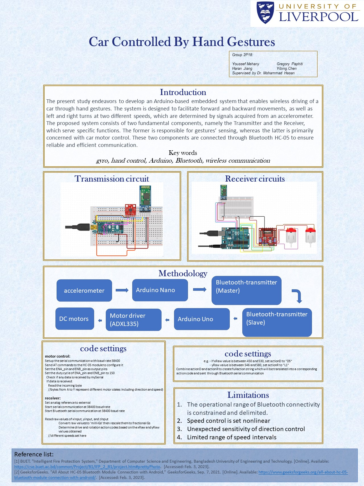

# 🚗 Gesture-Controlled Car

**Arduino-Based Embedded System | Wireless Car Control via Hand Gestures**

## 📖 Project Overview

Developed an **Arduino-based embedded system**, as an academic group project, that enables wireless driving of a car through **hand gestures**. The system controls forward, backward, left, and right movements at variable speeds, determined by data from an **accelerometer**. Communication between the controller and the car is established via **Bluetooth HC-05 modules** for seamless control.

## 🔧 Methodology

- **Sensors:** Accelerometer (ADXL335) for gesture detection  
- **Microcontrollers:** Arduino Nano (Transmitter) and Arduino Uno (Receiver)  
- **Communication:** Bluetooth modules (Master & Slave) for wireless transmission  
- **Actuators:** DC motors controlled via a Motor Driver  

## 🔗 Components

- **Accelerometer (ADXL335)** → Detects hand gestures  
- **Arduino Nano** → Processes gesture data and sends signals via Bluetooth  
- **Bluetooth HC-05 (Master/Slave)** → Wireless communication  
- **Arduino Uno** → Receives signals and drives motors  
- **Motor Driver (L298N)** → Controls the movement of DC motors  

## 📸 Project Poster

## ⚙️ Code Settings

- **Motor Control:**  
  - Serial communication set to **38400 baud rate**.  
  - Motor speeds vary based on **Raw accelerometer values**.  

- **Receiver Configuration:**  
  - Reads X/Y tilt angles and maps them to direction and speed.  
  - Interprets accelerometer data to control motors.

## 🚀 Limitations

1. Limited **Bluetooth connectivity range**.  
2. **Non-linear speed control** due to analog signal processing.  
3. **Sensitivity** of direction detection may vary.  
4. Restricted number of **speed intervals**.

## 📄 References

1. BUET, *Intelligent Fire Protection System*  
2. GeeksforGeeks, *Bluetooth HC-05 Module Connection*  

---

## 📄 License

This project was developed as part of a group project at the **University of Liverpool**.

